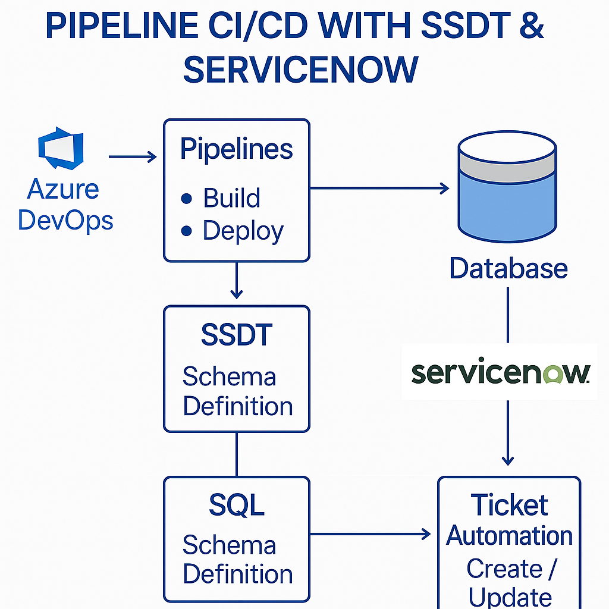

# 🚀 DevOps Database CI/CD Pipeline with SSDT, Azure DevOps & ServiceNow

This project demonstrates a complete **CI/CD pipeline for database deployment** using **Azure DevOps**, **SQL Server Data Tools (SSDT)**, **PowerShell automation**, and **ServiceNow ticketing integration**.

It includes:
- 📦 Version-controlled SQL stored procedures
- ⚙️ YAML pipelines for schema build and deployment
- 🧠 PowerShell automation to trigger SNOW tickets
- 📁 Organized folder structure for production-readiness

---

## 🧭 Architecture Diagram


---

## 🔧 Tech Stack

| Area             | Tools & Technologies                                    |
|------------------|----------------------------------------------------------|
| CI/CD Pipeline   | Azure DevOps, YAML, SSDT                                |
| Automation       | PowerShell, Azure CLI, Invoke-SQLCmd                    |
| Ticketing        | ServiceNow REST API                                      |
| Version Control  | Git, Branching Strategy                                  |
| Database Target  | SQL Server (On-prem / Azure SQL)                         |

---

## 📁 Folder Structure

```bash
devops-db-pipeline-cicd-ssdt/
│
├── pipelines/
│   ├── build.yml                  # SSDT schema build
│   └── release.yml                # Deployment to target DB
│
├── sql/
│   ├── usp_InsertEmployee_v1.sql
│   └── usp_InsertEmployee_v2.sql
│
├── automation/
│   ├── servicenow_ticket_auto.ps1
│   └── validate_deployment.ps1
│
└── README.md
```
---
 CI/CD Lifecycle
Code Commit (SQL) → GitHub

Build Pipeline (Azure DevOps)

Restores NuGet packages

Builds SSDT solution

Publishes DACPAC artifact

Release Pipeline

Downloads DACPAC

Triggers SNOW ticket (PowerShell)

Deploys schema to SQL Server

Post-deployment validation

Uses Invoke-SqlCmd to check success

Logs output for audit
---

🎯 Why This Matters
This setup automates database releases with auditability, traceability, and approval gates in mind. It's ideal for environments where:

✅ Compliance and rollback are critical

✅ Manual change approvals must be traceable

✅ Devs and DBAs need CI/CD parity with application teams
---

🧠 Key Features
✅ End-to-end CI/CD workflow for SQL deployments

✅ Integration with ServiceNow for ticket approval

✅ Version-controlled stored procedures

✅ Custom validation hooks post-deploy

✅ Modular folder structure to plug into real projects
---
📫 Let’s Connect
I specialize in database DevOps, cloud data engineering, and end-to-end data platform delivery.
This project is part of my portfolio to showcase automation leadership across both infrastructure and database layers.

📍 Based in Auckland, NZ — open to remote or hybrid roles
🔗 Connect on LinkedIn
